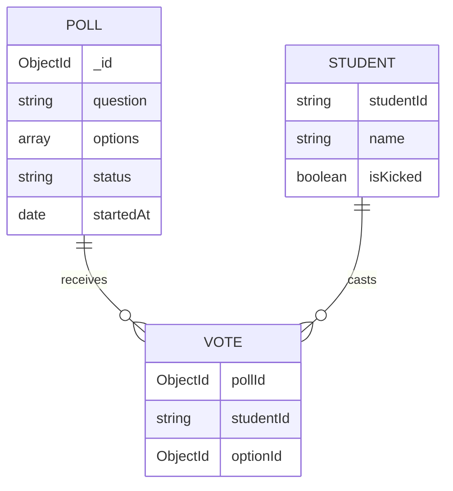

# 01 - System Overview: Mental Model & Architecture

> **Goal**: Build a complete mental model of what this system does, who uses it, and how it's architected at a high level.

---

## 1. Problem Statement

### What Problem Does This System Solve?

This system enables **real-time, interactive polling** in educational or presentation settings where:

- A **teacher/host** needs to gauge audience understanding instantly
- **Students/participants** need to submit responses in real-time
- Results must be **synchronized across all clients** immediately
- The system must be **resilient** to network issues, late joiners, and race conditions
- **State recovery** is critical (refresh shouldn't lose your vote or session)

### Real-World Use Case

Imagine a classroom scenario:
1. Teacher asks: "What is 2 + 2?"
2. Teacher creates a poll with options: A) 3, B) 4, C) 5, D) 6
3. Students see the poll **instantly** on their devices
4. Students vote **exactly once** (enforced by the server)
5. Teacher sees **live vote counts** as students respond
6. After 30 seconds (or when teacher ends it), results are shown with the **correct answer highlighted**
7. If a student refreshes mid-poll, they see the **same poll state** and their vote is preserved
8. If a student joins late, they see the **correct remaining time** (not restarted from the beginning)

---

## 2. Who Uses This System?

### Persona 1: Teacher (Host)
**Responsibilities:**
- Create polls with multiple-choice questions
- Mark correct answers for evaluation
- View live vote progress with percentage breakdown
- Manually end polls or let them auto-expire
- Kick disruptive students from the session
- View historical poll results and analytics
- Send messages to all students via chat

**Key Requirement:** Teacher needs **authoritative control** over the session.

---

### Persona 2: Student (Participant)
**Responsibilities:**
- Join sessions with just a name (no authentication required)
- Vote **exactly once per poll** (server enforces this)
- See live vote progress after voting
- Recover session state after refresh/disconnect
- Receive immediate feedback if kicked
- Send messages to everyone via chat

**Key Requirement:** Student experience must be **resilient** and **fair** (no double voting, no cheating).

---

## 3. High-Level System Responsibilities

The system is responsible for:

1. **Real-Time Synchronization**
   - All clients see the same poll state at the same time
   - Vote counts update live across all connected devices
   - Timer countdown is synchronized (late joiners see correct remaining time)

2. **State Management**
   - Server is the **single source of truth** for poll state
   - Database persists all votes, polls, and sessions
   - Clients can recover state after disconnect/refresh

3. **Race Condition Prevention**
   - Atomic vote operations (database-level unique constraint)
   - Server-side timer (not client-side)
   - Kicked state persists across reconnections

4. **Resilience**
   - Automatic reconnection on network failure
   - State recovery on page refresh
   - Late joiner synchronization

5. **Multi-User Coordination**
   - Participant list updates in real-time
   - Chat messages broadcast to all
   - Poll lifecycle events (start, update, end) broadcast to all

---

## 4. System Architecture (High-Level)

```
┌─────────────────────────────────────────────────────────────────────────────┐
│                           LIVE POLLING SYSTEM                                │
└─────────────────────────────────────────────────────────────────────────────┘

┌──────────────────────────────────────────────────────────────────────────────┐
│                              FRONTEND (React + Vite)                          │
├──────────────────────────────────────────────────────────────────────────────┤
│                                                                               │
│  ┌─────────────┐    ┌─────────────┐    ┌─────────────┐                     │
│  │   Teacher   │    │   Student   │    │    Poll     │                     │
│  │  Dashboard  │    │    Entry    │    │   History   │                     │
│  └──────┬──────┘    └──────┬──────┘    └──────┬──────┘                     │
│         │                  │                   │                             │
│         └──────────────────┴───────────────────┘                             │
│                            │                                                 │
│         ┌──────────────────┴──────────────────┐                             │
│         │                                      │                             │
│  ┌──────▼──────┐                      ┌───────▼────────┐                    │
│  │   Socket    │                      │      Poll      │                    │
│  │   Context   │◄─────────────────────┤    Context     │                    │
│  │  (Global)   │                      │   (Session)    │                    │
│  └──────┬──────┘                      └────────────────┘                    │
│         │                                                                    │
│         │ WebSocket (Socket.IO Client)                                      │
└─────────┼────────────────────────────────────────────────────────────────────┘
          │
          │ ws://backend:4000
          │
┌─────────▼────────────────────────────────────────────────────────────────────┐
│                         BACKEND (Node.js + Express)                           │
├───────────────────────────────────────────────────────────────────────────────┤
│                                                                               │
│  ┌─────────────────────────────────────────────────────────────────┐         │
│  │                    HTTP SERVER (Express)                         │         │
│  │  ┌──────────┐  ┌──────────┐  ┌──────────┐                       │         │
│  │  │   Poll   │  │   Vote   │  │ Student  │                       │         │
│  │  │  Routes  │  │  Routes  │  │  Routes  │                       │         │
│  │  └────┬─────┘  └────┬─────┘  └────┬─────┘                       │         │
│  │       │             │             │                              │         │
│  │  ┌────▼─────┐  ┌────▼─────┐  ┌────▼─────┐                       │         │
│  │  │   Poll   │  │   Vote   │  │ Student  │                       │         │
│  │  │Controller│  │Controller│  │Controller│                       │         │
│  │  └────┬─────┘  └────┬─────┘  └────┬─────┘                       │         │
│  └───────┼─────────────┼─────────────┼───────────────────────────────┘         │
│          │             │             │                                       │
│  ┌───────▼─────────────▼─────────────▼───────────────────────┐               │
│  │                    SERVICE LAYER                           │               │
│  │  ┌──────────┐  ┌──────────┐  ┌──────────┐  ┌──────────┐  │               │
│  │  │   Poll   │  │   Vote   │  │ Student  │  │   Chat   │  │               │
│  │  │ Service  │  │ Service  │  │ Service  │  │ Service  │  │               │
│  │  └────┬─────┘  └────┬─────┘  └────┬─────┘  └────┬─────┘  │               │
│  │       │             │             │             │         │               │
│  │  ┌────▼─────────────▼─────────────▼─────────────▼─────┐  │               │
│  │  │              Timer Service                          │  │               │
│  │  │  (Server-authoritative countdown & auto-end)        │  │               │
│  │  └─────────────────────────────────────────────────────┘  │               │
│  └────────────────────────────┬───────────────────────────────┘               │
│                               │                                               │
│  ┌────────────────────────────▼───────────────────────────────┐               │
│  │              SOCKET.IO SERVER (Real-Time Events)            │               │
│  │  ┌──────────────────┐         ┌──────────────────┐         │               │
│  │  │  Poll Socket     │         │  Chat Socket     │         │               │
│  │  │  - poll:start    │         │  - chat:message  │         │               │
│  │  │  - poll:update   │         │  - chat:history  │         │               │
│  │  │  - poll:end      │         │                  │         │               │
│  │  │  - vote:submit   │         │                  │         │               │
│  │  │  - student:join  │         │                  │         │               │
│  │  │  - student:kick  │         │                  │         │               │
│  │  └──────────────────┘         └──────────────────┘         │               │
│  └────────────────────────────────────────────────────────────┘               │
│                               │                                               │
└───────────────────────────────┼───────────────────────────────────────────────┘
                                │
                                │ MongoDB Driver (Mongoose)
                                │
┌───────────────────────────────▼───────────────────────────────────────────────┐
│                         DATABASE (MongoDB Atlas)                              │
├───────────────────────────────────────────────────────────────────────────────┤
│                                                                               │
│  ┌──────────────┐  ┌──────────────┐  ┌──────────────┐  ┌──────────────┐     │
│  │    polls     │  │    votes     │  │studentsessions│ │chatmessages  │     │
│  │              │  │              │  │              │  │              │     │
│  │ - question   │  │ - pollId     │  │ - studentId  │  │ - sender     │     │
│  │ - options[]  │  │ - studentId  │  │ - name       │  │ - text       │     │
│  │ - duration   │  │ - optionId   │  │ - socketId   │  │ - role       │     │
│  │ - status     │  │ - votedAt    │  │ - isKicked   │  │ - timestamp  │     │
│  │ - startedAt  │  │              │  │ - isActive   │  │              │     │
│  │ - endedAt    │  │ UNIQUE INDEX │  │              │  │              │     │
│  │              │  │ (pollId +    │  │              │  │              │     │
│  │              │  │  studentId)  │  │              │  │              │     │
│  └──────────────┘  └──────────────┘  └──────────────┘  └──────────────┘     │
│                                                                               │
└───────────────────────────────────────────────────────────────────────────────┘

DATA FLOW LEGEND:
─────► HTTP Request/Response
═════► WebSocket Bidirectional
─ ─ ─► Database Query
```

---

## 5. Technology Stack & Rationale

### Backend
| Technology | Purpose | Why This Choice? |
|------------|---------|------------------|
| **Node.js** | Runtime | Non-blocking I/O perfect for real-time apps |
| **Express** | HTTP Server | Industry standard, minimal overhead |
| **Socket.IO** | WebSocket | Automatic fallback to polling, built-in reconnection |
| **MongoDB** | Database | Flexible schema, horizontal scaling, good for real-time data |
| **Mongoose** | ODM | Schema validation, middleware hooks, easier queries |
| **TypeScript** | Language | Type safety prevents runtime errors |

### Frontend
| Technology | Purpose | Why This Choice? |
|------------|---------|------------------|
| **React** | UI Framework | Component-based, efficient re-rendering |
| **TypeScript** | Language | Type safety, better IDE support |
| **Vite** | Build Tool | Fast HMR, optimized builds |
| **Socket.IO Client** | WebSocket | Matches backend, automatic reconnection |
| **React Router** | Routing | Standard for SPA navigation |
| **Context API** | State Management | Built-in, no extra dependencies for simple state |

### Infrastructure
| Technology | Purpose | Why This Choice? |
|------------|---------|------------------|
| **Docker** | Containerization | Consistent environments, easy deployment |
| **Docker Compose** | Orchestration | Multi-container setup (local dev + production) |

---

## 6. Key Design Decisions

### Decision 1: Server-Authoritative Timer
**Why?**
- If each client runs its own timer, late joiners would see the full duration (unfair)
- Network latency would cause desynchronization
- Clients could manipulate client-side timers

**How?**
- Server starts a `setTimeout` when poll is created
- Server broadcasts `serverTime` with every poll state
- Clients calculate remaining time: `duration - (now - startedAt)`
- Late joiners get the **correct** remaining time

---

### Decision 2: Atomic Vote Operations
**Why?**
- Race condition: Two rapid clicks could submit two votes
- Multiple browser tabs could bypass client-side checks

**How?**
- Database unique compound index: [(pollId, studentId)](file:///Users/ayushsinghchauhan/Downloads/INTERVUE_1/Ver_5/IntervueAssignment/frontend/src/App.tsx#13-42)
- If duplicate vote is attempted, MongoDB throws error code `11000`
- Service layer catches this and returns "already voted" error
- **Database enforces the rule, not application logic**

---

### Decision 3: Persistent Kicked State
**Why?**
- If kicked state is only in memory, student could refresh and rejoin
- Kicked students should **never** be able to rejoin

**How?**
- `isKicked` flag in [StudentSession](file:///Users/ayushsinghchauhan/Downloads/INTERVUE_1/Ver_5/IntervueAssignment/backend/src/models/StudentSession.ts#3-11) model (persisted in MongoDB)
- On every join attempt, backend checks `isKicked` flag
- If kicked, registration is rejected with 403 error
- Frontend shows permanent "You've been kicked" message

---

### Decision 4: Single Socket Connection Per Client
**Why?**
- Multiple socket connections waste resources
- Harder to track which socket belongs to which student
- Reconnection logic becomes complex

**How?**
- [SocketContext](file:///Users/ayushsinghchauhan/Downloads/INTERVUE_1/Ver_5/IntervueAssignment/frontend/src/context/SocketContext.tsx#64-71) creates **one** socket on app mount
- Socket is shared across all components via React Context
- Socket persists across route changes
- On reconnect, student re-emits `student:join` to update socket ID

---

### Decision 5: Controller-Service Pattern
**Why?**
- Separation of concerns (HTTP handling vs business logic)
- Services can be reused by both HTTP routes and Socket handlers
- Easier to test business logic in isolation

**How?**
- **Controllers**: Handle HTTP requests, validate input, format responses
- **Services**: Contain business logic, database operations, no HTTP knowledge
- **Socket Handlers**: Call services directly, emit events

---

### Decision 6: No Authentication (Session-Based Identity)
**Why?**
- Use case is classroom polling, not secure banking
- Friction of login would reduce participation
- Teacher doesn't need to manage accounts

**How?**
- Student generates a unique ID (nanoid) on first visit
- ID stored in `sessionStorage` (survives refresh, not browser close)
- Backend trusts this ID for vote deduplication
- **Trade-off**: Students could clear storage and vote again (acceptable for this use case)

---

## 7. System Characteristics

### Consistency Model
- **Eventual Consistency** for UI updates (Socket.IO broadcasts)
- **Strong Consistency** for votes (MongoDB ACID transactions)

### Failure Modes
- **Network Partition**: Client shows "disconnected" state, auto-reconnects
- **Server Crash**: All timers lost, but poll state persists in DB
- **Database Unavailable**: Server returns 500, clients retry

### Scalability Limits
- **Current Design**: Single server, single MongoDB instance
- **Bottleneck**: Socket.IO server (all clients connect to one process)
- **Scaling Strategy** (future): Redis adapter for Socket.IO, horizontal scaling

---

## 8. What This System Does NOT Do

To set clear boundaries:

❌ **No user authentication** (no passwords, no OAuth)  
❌ **No poll editing** (once created, poll is immutable)  
❌ **No multi-room support** (all users are in one global session)  
❌ **No poll scheduling** (polls are created and started immediately)  
❌ **No analytics dashboard** (just basic history view)  
❌ **No file uploads** (text-only questions and options)

---

## 9. Mental Model Summary

Think of this system as a **synchronized state machine** where:

1. **Server** holds the authoritative state (current poll, votes, participants)
2. **Database** persists the state (survives server restarts)
3. **Socket.IO** broadcasts state changes to all clients (real-time sync)
4. **Clients** render the state and send user actions back to the server
5. **Timer Service** orchestrates poll lifecycle (start → active → end → idle)

**Data flows in one direction:**
```
User Action → Client → Server → Database → Server → All Clients → UI Update
```

**State recovery:**
```
Client Refresh → Fetch current state from server → Render UI
```

# 02 - Bootstrap Flow: Application Startup Sequence

> **Goal**: Understand exactly what happens when the application starts, in what order, and why each step exists.

---

## Overview

The bootstrap flow is the **foundation** of the system. If any step fails, the application won't work correctly. This document traces the startup sequence for:

1. **Backend** (Node.js server)
2. **Frontend** (React application)
3. **Docker** (containerized deployment)

---

## 1. Backend Bootstrap Flow

### Entry Point: [backend/src/server.ts](file:///Users/ayushsinghchauhan/Downloads/INTERVUE_1/Ver_5/IntervueAssignment/backend/src/server.ts)

The backend starts when you run:
- **Development**: `npm run dev` → `nodemon src/server.ts`
- **Production**: `npm start` → `node dist/server.js`

---

### Startup Sequence (Step-by-Step)

```
┌─────────────────────────────────────────────────────────────────┐
│                    BACKEND STARTUP FLOW                          │
└─────────────────────────────────────────────────────────────────┘

1. Node.js Process Starts
   │
   ├─► Load server.ts
   │
2. Import Dependencies
   │
   ├─► import express
   ├─► import { createServer } from 'http'
   ├─► import { Server } from 'socket.io'
   ├─► import cors, dotenv
   ├─► import connectDB (database config)
   ├─► import routes (poll, vote, student)
   ├─► import socket handlers (poll, chat)
   ├─► import services (timer)
   │
3. Load Environment Variables
   │
   ├─► dotenv.config()
   ├─► Reads .env file
   ├─► Sets process.env.MONGODB_URI, PORT, CORS_ORIGIN, NODE_ENV
   │   ⚠️ FAILURE: If .env missing → uses defaults (may fail in production)
   │
4. Initialize Express App
   │
   ├─► const app = express()
   ├─► const httpServer = createServer(app)
   │   WHY? Socket.IO needs the HTTP server, not just Express
   │
5. Initialize Socket.IO
   │
   ├─► const io = new Server(httpServer, { cors: {...} })
   ├─► Configure CORS for WebSocket connections
   │   WHY? Browser security requires explicit CORS for WS
   │
6. Register Middleware (ORDER MATTERS!)
   │
   ├─► app.use(cors({...}))           // Enable CORS for all routes
   ├─► app.options('*', cors())       // Handle preflight requests
   ├─► app.use(express.json())        // Parse JSON request bodies
   ├─► app.use(express.urlencoded())  // Parse URL-encoded bodies
   ├─► app.use((req, res, next) => {  // Request logger
   │       console.log(`${req.method} ${req.path}`)
   │       next()
   │   })
   │   ⚠️ ORDER CRITICAL: CORS must come before routes
   │
7. Mount API Routes
   │
   ├─► app.use('/api/poll', pollRoutes)
   ├─► app.use('/api/poll', voteRoutes)    // Note: Same prefix!
   ├─► app.use('/api/student', studentRoutes)
   │   WHY? Modular routing, easier to maintain
   │
8. Mount Utility Routes
   │
   ├─► app.get('/health', ...)        // Health check endpoint
   ├─► app.use((req, res) => {...})   // 404 handler
   ├─► app.use((err, req, res, next) => {...}) // Error handler
   │   WHY? 404 and error handlers MUST come last
   │
9. Setup Socket.IO Handlers
   │
   ├─► setupPollSocket(io)
   ├─► setupChatSocket(io)
   │   Registers event listeners: student:join, vote:submit, etc.
   │
10. Attach Socket.IO to Express
    │
    ├─► app.set('io', io)
    │   WHY? Controllers need access to io for broadcasting
    │
11. Configure Timer Service
    │
    ├─► timerService.setSocketIO(io)
    │   WHY? Timer service needs to emit poll:end events
    │
12. Connect to Database
    │
    ├─► await connectDB()
    │   ├─► mongoose.connect(process.env.MONGODB_URI)
    │   ├─► console.log('✅ MongoDB connected')
    │   │
    │   ⚠️ FAILURE: If MongoDB unreachable → process.exit(1)
    │
13. Start HTTP Server
    │
    ├─► httpServer.listen(PORT, () => {...})
    │   ├─► console.log('🚀 Server running on port 4000')
    │   ├─► console.log('📡 Socket.IO ready')
    │   │
    │   ⚠️ FAILURE: If port in use → EADDRINUSE error
    │
14. Register Graceful Shutdown
    │
    └─► process.on('SIGTERM', () => {
            timerService.clearAllTimers()
            httpServer.close()
            process.exit(0)
        })
        WHY? Clean shutdown prevents orphaned timers
```

---

### Critical Files Involved

| File | Role | What Breaks If Missing? |
|------|------|-------------------------|
| [server.ts](file:///Users/ayushsinghchauhan/Downloads/INTERVUE_1/Ver_5/IntervueAssignment/backend/src/server.ts) | Entry point | Nothing starts |
| [config/database.ts](file:///Users/ayushsinghchauhan/Downloads/INTERVUE_1/Ver_5/IntervueAssignment/backend/src/config/database.ts) | DB connection | No data persistence |
| [routes/poll.routes.ts](file:///Users/ayushsinghchauhan/Downloads/INTERVUE_1/Ver_5/IntervueAssignment/backend/src/routes/poll.routes.ts) | Poll API routes | Can't create/fetch polls |
| [routes/vote.routes.ts](file:///Users/ayushsinghchauhan/Downloads/INTERVUE_1/Ver_5/IntervueAssignment/backend/src/routes/vote.routes.ts) | Vote API routes | Can't submit votes |
| [routes/student.routes.ts](file:///Users/ayushsinghchauhan/Downloads/INTERVUE_1/Ver_5/IntervueAssignment/backend/src/routes/student.routes.ts) | Student API routes | Can't validate sessions |
| [sockets/poll.socket.ts](file:///Users/ayushsinghchauhan/Downloads/INTERVUE_1/Ver_5/IntervueAssignment/backend/src/sockets/poll.socket.ts) | Real-time poll events | No live updates |
| [sockets/chat.socket.ts](file:///Users/ayushsinghchauhan/Downloads/INTERVUE_1/Ver_5/IntervueAssignment/backend/src/sockets/chat.socket.ts) | Real-time chat events | No chat functionality |
| [services/timer.service.ts](file:///Users/ayushsinghchauhan/Downloads/INTERVUE_1/Ver_5/IntervueAssignment/backend/src/services/timer.service.ts) | Auto-end polls | Polls never end automatically |

---

### Environment Variables ([.env](file:///Users/ayushsinghchauhan/Downloads/INTERVUE_1/Ver_5/IntervueAssignment/backend/.env))

```bash
MONGODB_URI=mongodb://localhost:27017/live-polling  # Database connection string
PORT=4000                                           # Server port
CORS_ORIGIN=http://localhost:5173                  # Frontend URL (for CORS)
NODE_ENV=development                                # Environment mode
```

**What happens if missing?**
- `MONGODB_URI`: Uses default `mongodb://localhost:27017/live-polling` (fails if MongoDB not local)
- `PORT`: Uses default `5000` (may conflict with other services)
- `CORS_ORIGIN`: Uses default `http://localhost:5173` (breaks if frontend on different port)
- `NODE_ENV`: Defaults to `undefined` (may affect logging/error handling)

---

## 2. Frontend Bootstrap Flow

### Entry Point: [frontend/index.html](file:///Users/ayushsinghchauhan/Downloads/INTERVUE_1/Ver_5/IntervueAssignment/frontend/index.html)

The frontend starts when you navigate to `http://localhost:5173` (or production URL).

---

### Startup Sequence (Step-by-Step)

```
┌─────────────────────────────────────────────────────────────────┐
│                   FRONTEND STARTUP FLOW                          │
└─────────────────────────────────────────────────────────────────┘

1. Browser Loads index.html
   │
   ├─► HTML parsed
   ├─► <div id="root"></div> created
   ├─► <script type="module" src="/src/main.tsx"></script> loaded
   │   WHY? Vite uses ES modules for fast HMR
   │
2. Vite Dev Server Processes main.tsx
   │
   ├─► TypeScript compiled to JavaScript
   ├─► Import dependencies resolved
   │
3. main.tsx Executes
   │
   ├─► import React, ReactDOM
   ├─► import App from './App.tsx'
   ├─► import './index.css'  // Global styles
   │
4. React Root Created
   │
   ├─► createRoot(document.getElementById('root')!)
   ├─► .render(<StrictMode><App /></StrictMode>)
   │   WHY? StrictMode helps catch bugs in development
   │
5. App Component Mounts
   │
   ├─► <SocketProvider> wraps entire app
   │   │
   │   ├─► useEffect runs (on mount)
   │   ├─► const socket = io(VITE_SOCKET_URL)
   │   ├─► socket.on('connect', ...) registered
   │   ├─► socket.on('disconnect', ...) registered
   │   │   WHY? Single socket connection for entire app
   │   │
   │   ├─► <PollProvider> wraps routes
   │   │   │
   │   │   ├─► Reads sessionStorage.getItem('studentInfo')
   │   │   ├─► Initializes state: studentInfo, hasVoted, votedOptionId
   │   │   │   WHY? Restore session after refresh
   │   │   │
   │   │   ├─► <BrowserRouter> wraps routes
   │   │   │   │
   │   │   │   ├─► React Router initializes
   │   │   │   ├─► Reads current URL path
   │   │   │   ├─► Matches route (/, /student/join, /student/poll, etc.)
   │   │   │   │
   │   │   │   └─► Renders matched component
   │   │   │       │
   │   │   │       ├─► If path = '/' → <RoleSelection />
   │   │   │       ├─► If path = '/student/join' → <StudentEntry />
   │   │   │       ├─► If path = '/student/poll' → <ProtectedStudentRoute>
   │   │   │       │                                  <StudentPoll />
   │   │   │       │                                </ProtectedStudentRoute>
   │   │   │       ├─► If path = '/teacher/dashboard' → <TeacherDashboard />
   │   │   │       └─► If path = '/teacher/history' → <PollHistory />
   │
6. Initial Page Component Mounts
   │
   ├─► Component-specific useEffect hooks run
   ├─► API calls made (if needed)
   ├─► Socket listeners registered (if needed)
   │
7. Socket Connection Established
   │
   └─► SocketContext.isConnected = true
       UI shows "Connected" indicator (if implemented)
```

---

### Critical Files Involved

| File | Role | What Breaks If Missing? |
|------|------|-------------------------|
| [index.html](file:///Users/ayushsinghchauhan/Downloads/INTERVUE_1/Ver_5/IntervueAssignment/frontend/index.html) | HTML entry point | Nothing renders |
| [main.tsx](file:///Users/ayushsinghchauhan/Downloads/INTERVUE_1/Ver_5/IntervueAssignment/frontend/src/main.tsx) | React entry point | React doesn't mount |
| [App.tsx](file:///Users/ayushsinghchauhan/Downloads/INTERVUE_1/Ver_5/IntervueAssignment/frontend/src/App.tsx) | Root component | No routing |
| [context/SocketContext.tsx](file:///Users/ayushsinghchauhan/Downloads/INTERVUE_1/Ver_5/IntervueAssignment/frontend/src/context/SocketContext.tsx) | Socket connection | No real-time updates |
| [context/PollContext.tsx](file:///Users/ayushsinghchauhan/Downloads/INTERVUE_1/Ver_5/IntervueAssignment/frontend/src/context/PollContext.tsx) | Session state | No state recovery |

---

### Environment Variables ([.env](file:///Users/ayushsinghchauhan/Downloads/INTERVUE_1/Ver_5/IntervueAssignment/backend/.env))

```bash
VITE_API_URL=http://localhost:4000      # Backend API base URL
VITE_SOCKET_URL=ws://localhost:4000     # Backend WebSocket URL
```

**What happens if missing?**
- `VITE_API_URL`: Defaults to `http://localhost:5000` (wrong port → API calls fail)
- `VITE_SOCKET_URL`: Defaults to `http://localhost:5000` (wrong port → no real-time updates)

**Why `VITE_` prefix?**
- Vite only exposes env vars starting with `VITE_` to the client
- Security: Prevents accidentally leaking server-side secrets

---

## 3. Docker Bootstrap Flow

### Local Development ([docker-compose-local.yml](file:///Users/ayushsinghchauhan/Downloads/INTERVUE_1/Ver_5/IntervueAssignment/docker-compose-local.yml))

```
┌─────────────────────────────────────────────────────────────────┐
│                  DOCKER COMPOSE LOCAL FLOW                       │
└─────────────────────────────────────────────────────────────────┘

1. Run: docker-compose -f docker-compose-local.yml up --build
   │
2. Docker Compose Reads Configuration
   │
   ├─► Parses docker-compose-local.yml
   ├─► Identifies services: backend, frontend
   ├─► Creates network: polling-network
   │
3. Build Backend Image
   │
   ├─► FROM node:18-alpine (base image)
   ├─► WORKDIR /app
   ├─► COPY package*.json ./
   ├─► RUN npm install
   ├─► COPY . .
   ├─► RUN npm run build  (TypeScript → JavaScript)
   │   │
   │   ├─► Multi-stage build (optimization)
   │   ├─► FROM node:18-alpine (fresh image)
   │   ├─► COPY package*.json ./
   │   ├─► RUN npm install --only=production
   │   ├─► COPY --from=builder /app/dist ./dist
   │   │
   │   └─► CMD ["node", "dist/server.js"]
   │
4. Build Frontend Image
   │
   ├─► FROM node:18-alpine
   ├─► WORKDIR /app
   ├─► COPY package*.json ./
   ├─► RUN npm install
   ├─► COPY . .
   ├─► ARG VITE_API_URL, VITE_SOCKET_URL (from docker-compose)
   ├─► ENV VITE_API_URL=$VITE_API_URL
   ├─► RUN npm run build  (Vite build with env vars baked in)
   │   │
   │   ├─► Multi-stage build
   │   ├─► FROM node:18-alpine
   │   ├─► RUN npm install -g sirv-cli (static server)
   │   ├─► COPY --from=builder /app/dist ./dist
   │   │
   │   └─► CMD ["sirv", "dist", "--port", "5173", "--host", "0.0.0.0", "--single"]
   │       WHY? --single enables SPA routing (all routes → index.html)
   │
5. Start Containers
   │
   ├─► Backend container starts
   │   ├─► Reads .env file (mounted from host)
   │   ├─► Connects to MongoDB (MONGODB_URI from .env)
   │   ├─► Listens on port 4000 (mapped to host:4000)
   │   │
   │   ⚠️ FAILURE: If MongoDB URI invalid → container exits
   │
   ├─► Frontend container starts
   │   ├─► Serves static files from /app/dist
   │   ├─► Listens on port 5173 (mapped to host:5173)
   │   │
   │   ⚠️ FAILURE: If port 5173 in use → container fails to start
   │
6. Network Configuration
   │
   └─► Both containers on polling-network
       Frontend can reach backend via http://backend:4000
       (Docker DNS resolves 'backend' to container IP)
```

---

### Production Deployment ([docker-compose.yml](file:///Users/ayushsinghchauhan/Downloads/INTERVUE_1/Ver_5/IntervueAssignment/docker-compose.yml))

**Key Differences:**
- Frontend build args use **production URLs** (not localhost)
- Backend uses **MongoDB Atlas** (cloud database, not local)
- Containers run in **detached mode** (`-d` flag)

---

## 4. Startup Failure Scenarios

### Backend Failures

| Failure | Symptom | Root Cause | Fix |
|---------|---------|------------|-----|
| **Port in use** | `EADDRINUSE` error | Another process on port 4000 | Kill process or change PORT in .env |
| **MongoDB unreachable** | `MongoNetworkError` | Wrong URI or MongoDB not running | Check MONGODB_URI, start MongoDB |
| **Missing .env** | Uses defaults | .env file not created | Copy .env.example to .env |
| **Import error** | `Cannot find module` | Missing dependency | Run `npm install` |

---

### Frontend Failures

| Failure | Symptom | Root Cause | Fix |
|---------|---------|------------|-----|
| **Blank page** | White screen, no errors | React root not found | Check [index.html](file:///Users/ayushsinghchauhan/Downloads/INTERVUE_1/Ver_5/IntervueAssignment/frontend/index.html) has `<div id="root">` |
| **API calls fail** | Network errors in console | Wrong VITE_API_URL | Update .env and rebuild |
| **Socket not connecting** | No real-time updates | Wrong VITE_SOCKET_URL | Update .env and rebuild |
| **Build fails** | TypeScript errors | Type errors in code | Fix type errors |

---

### Docker Failures

| Failure | Symptom | Root Cause | Fix |
|---------|---------|------------|-----|
| **Build fails** | `npm install` errors | Network issues or wrong Node version | Check internet, use correct Node version |
| **Container exits** | Container stops immediately | Application crashes on startup | Check logs: `docker logs <container_id>` |
| **Port conflict** | `port is already allocated` | Host port in use | Stop conflicting service or change port mapping |

---

## 5. Critical Startup Dependencies

### Backend Dependencies (Must Succeed)

1. ✅ **Environment variables loaded** (dotenv)
2. ✅ **MongoDB connection established** (connectDB)
3. ✅ **Express server listening** (httpServer.listen)
4. ✅ **Socket.IO initialized** (io)

**If any fail → Server exits with code 1**

---

### Frontend Dependencies (Must Succeed)

1. ✅ **HTML loaded** (index.html)
2. ✅ **React mounted** (createRoot)
3. ✅ **Socket connection established** (SocketContext)

**If any fail → App doesn't render or real-time features broken**

---

## 6. Startup Timing

### Development Mode
- **Backend**: ~2-3 seconds (TypeScript compilation + DB connection)
- **Frontend**: ~1-2 seconds (Vite dev server + React mount)

### Production Mode (Docker)
- **Backend build**: ~30-60 seconds (npm install + TypeScript build)
- **Frontend build**: ~30-60 seconds (npm install + Vite build)
- **Container start**: ~2-3 seconds

---
# 03 - Request → Response Flow (API Lifecycle)

> **Goal**: Trace the exact path of a single HTTP request from entry to exit, understanding every layer it passes through.

---

## Overview

The backend follows a strict **Layered Architecture** (Controller-Service-Repository pattern). This ensures separation of concerns:

1. **Routes**: Map URLs to controllers
2. **Controllers**: Handle HTTP (request/response), validation, and status codes
3. **Services**: Contain business logic (reusable by Sockets too)
4. **Models/Database**: Handle data persistence

---

## 1. The Request Lifecycle

Steps a request takes when a client calls `POST /api/poll`:

```
┌─────────────────────────────────────────────────────────────────────────────┐
│                          HTTP REQUEST LIFECYCLE                              │
└─────────────────────────────────────────────────────────────────────────────┘

1. ENTRY: Client sends Request
   │
   ├─► Method: POST
   ├─► URL: http://localhost:4000/api/poll
   ├─► Body: { question: "...", options: [...] }
   │
2. SERVER: Express App (server.ts)
   │
   ├─► Middleware Chain executes:
   │   ├─► cors()                  (Allows frontend to access API)
   │   ├─► express.json()          (Parses body string -> JSON object)
   │   └─► requestLogger           (Logs "POST /api/poll")
   │
3. ROUTING: Route matching (poll.routes.ts)
   │
   ├─► Matches '/api/poll' prefix in server.ts
   ├─► Matches '/' path in poll.routes.ts
   └─► Dispatches to `pollController.createPoll`
       │
4. CONTROLLER: Request Handling (poll.controller.ts)
   │
   ├─► Validates input (Req.body has question? options?)
   ├─► IF Invalid → Returns 400 Bad Request
   ├─► IF Valid   → Calls calls `pollService.createPoll(data)`
   │
5. SERVICE: Business Logic (poll.service.ts)
   │
   ├─► Checks rules (Is there already an active poll?)
   ├─► Prepares data (Adds timestamps, default values)
   └─► Calls Model to save
       │
6. DATABASE: Persistence (Poll.ts / MongoDB)
   │
   ├─► Mongoose validates schema
   ├─► Inserts document into 'polls' collection
   └─► Returns saved document with _id
       │
7. RESPONSE: Formatting & Sending
   │
   ├─► Service returns Poll object
   ├─► Controller formats JSON response
   └─► res.status(201).json({ ... }) sent to Client
```

---

## 2. Detailed Flow: Create Poll

Let's trace **Poll Creation** as a concrete example.

### Step-by-Step Code References

#### 1. Route Definition
**File**: [backend/src/routes/poll.routes.ts](file:///Users/ayushsinghchauhan/Downloads/INTERVUE_1/Ver_5/IntervueAssignment/backend/src/routes/poll.routes.ts)

```typescript
router.post('/', pollController.createPoll);
```
- **Why?** Keeps routing logic separate from implementation.

#### 2. Controller Logic
**File**: [backend/src/controllers/poll.controller.ts](file:///Users/ayushsinghchauhan/Downloads/INTERVUE_1/Ver_5/IntervueAssignment/backend/src/controllers/poll.controller.ts)

```typescript
async createPoll(req: Request, res: Response): Promise<void> {
    try {
        const { question, options, duration } = req.body;

        // 1. Validation (HTTP responsbility)
        if (!question || !options || !duration) {
            res.status(400).json({ error: 'Missing required fields' });
            return;
        }

        // 2. Call Service (Business Logic)
        const poll = await pollService.createPoll({ question, options, duration });

        // 3. Side Effect (Start Timer)
        timerService.startPollTimer(poll._id.toString(), duration);

        // 4. Send Response
        res.status(201).json({ ... });
    } catch (error: any) {
        res.status(400).json({ error: error.message });
    }
}
```
- **What?** It translates HTTP request to a function call and HTTP response from the result.
- **Why?** Controllers should NOT know about database queries. They just coordinate.

#### 3. Service Logic
**File**: [backend/src/services/poll.service.ts](file:///Users/ayushsinghchauhan/Downloads/INTERVUE_1/Ver_5/IntervueAssignment/backend/src/services/poll.service.ts)

```typescript
async createPoll(data: CreatePollData): Promise<IPoll> {
    // 1. Business Rule Check
    const existingActivePoll = await Poll.findOne({ status: 'ACTIVE' });
    if (existingActivePoll) {
        throw new Error('An active poll already exists...');
    }

    // 2. Data Preparation
    const poll = new Poll({
        question: data.question,
        options: data.options.map(opt => ({
            _id: new mongoose.Types.ObjectId(), // Generate IDs for options explicitly
            text: opt.text,
            isCorrect: opt.isCorrect,
            voteCount: 0
        })),
        duration: data.duration,
        status: 'ACTIVE',
        startedAt: new Date()
    });

    // 3. Database Interaction
    await poll.save();
    return poll;
}
```
- **What?** Enforces "One active poll at a time" rule.
- **Why?** If we put this in the controller, we couldn't reuse it for a socket event or CLI tool.

---

## 3. Detailed Flow: Get Current Poll

This request is simpler (Read-only) but has complex logic for "ResultsView" vs "Idle".

```
[Client] GET /api/poll/current
   │
   ▼
[Route] router.get('/current', pollController.getCurrentPoll)
   │
   ▼
[Controller] calls pollService.getCurrentPoll()
   │
   ▼
[Service] pollService.getCurrentPoll()
   │
   ├─► Find ACTIVE poll?
   │     ├─► YES: Return formatted active poll
   │     └─► NO: Check for recently ENDED poll (< 5 seconds ago)
   │           ├─► YES: Return ENDED poll (Show results)
   │           └─► NO: Return { status: 'IDLE' }
   │
   ▼
[Controller] res.json(pollState)
```

**Key Insight**: The **Service** hides the complexity of "checking for recently ended polls". The Controller just asks "what is the current state?" and the Service figures it out. This is excellent abstraction.

---

## 4. Error Handling Flow

How errors propagate up the stack within a request:

1. **Database Error** (e.g. Connection failed)
   - Thrown by Mongoose in `Service`
2. **Service Error** (e.g. "Active poll exists")
   - Thrown explicitly by `Service` logic
3. **Controller Catch Block**
   - Catches BOTH types of errors
   - `try { ... } catch (error) { ... }`
4. **Response**
   - Controller decides the status code (400 for logic error, 500 for system error)
   - Sends JSON `{ error: "message" }`

**Code Reference**: [poll.controller.ts](file:///Users/ayushsinghchauhan/Downloads/INTERVUE_1/Ver_5/IntervueAssignment/backend/src/controllers/poll.controller.ts#L48-L50)

```typescript
} catch (error: any) {
    res.status(400).json({ error: error.message });
}
```

---

## 5. Why This Architecture?

| Component | Responsibility | Benefit |
|-----------|----------------|---------|
| **Middleware** | Cross-cutting concerns (Auth, Logging) | Don't repeat code in every controller |
| **Controller** | HTTP Protocol (Req/Res/Status) | Flexible API (Rest/GraphQL compatible) |
| **Service** | Pure Business Logic | Reusable by Socket.IO handlers |
| **Model** | Data Rules (Schema) | Data Integrity |

**Critical Observation**:
Notice that `timerService.startPollTimer` is called in the **Controller**, not the **Poll Service**.
- **Why?** Because the `PollService` creates the *record*. The side effect of starting a *timer* (which involves Sockets) is coordinated by the controller layer (or a higher-level orchestrator). Ideally, this could be event-driven, but calling it in the controller is a pragmatic choice here.

---

## Next Steps

Now that you understand how a standard API request works, trace how we identify *who* is making the request:
- **[04_AUTHENTICATION_FLOW.md](./04_AUTHENTICATION_FLOW.md)**

---

**Document Status**: ✅ Complete
**Last Updated**: 2026-01-18


# 04 - Authentication Flow: Zero-Friction Identity

> **Goal**: Understand how users are identified and secured without traditional usernames/passwords.

---

## 1. The "Zero-Friction" Identity Model

This system uses a **Session-Based Identity** model tailored for disposable classroom sessions.

- **No Passwords**: Students join with just a name.
- **No Accounts**: Identity lasts only for the session duration.
- **Device-Bound**: Identity is tied to the browser's `sessionStorage`.

### Why this approach?
- **Speed**: Students can join in < 5 seconds.
- **Privacy**: No personal data (email/phone) required.
- **Simplicity**: No "forgot password" flows.

---

## 2. Student Registration Flow

When a new student arrives at `/student/join`.

```
┌─────────────────────────────────────────────────────────────────────────────┐
│                          STUDENT JOIN FLOW                                   │
└─────────────────────────────────────────────────────────────────────────────┘

1. FRONTEND: Input Name
   │
   ├─► User types "Alice"
   ├─► Generated UUID (nanoid) creates `studentId` internally
   │
2. API CALL: POST /api/student/register
   │
   ├─► Body: { studentId: "xyz-123", name: "Alice", socketId: "sock_abc" }
   │
3. BACKEND: Validation (StudentService)
   │
   ├─► Check: Does studentId exist?
   │     ├─► NO: Create NEW StudentSession document
   │     │       └─► isKicked: false, isActive: true
   │     │
   │     └─► YES: Check `isKicked` status
   │           ├─► TRUE: Throw Error "You have been kicked" 🛑
   │           └─► FALSE: Update name & socketId (Re-join)
   │
4. RESPONSE
   │
   ├─► Success: { success: true }
   └─► Failure: { error: "You have been kicked..." }
```

### Key Files
- **Frontend**: [frontend/src/pages/StudentEntry.tsx](file:///Users/ayushsinghchauhan/Downloads/INTERVUE_1/Ver_5/IntervueAssignment/frontend/src/pages/StudentEntry.tsx)
- **Backend Route**: [backend/src/routes/student.routes.ts](file:///Users/ayushsinghchauhan/Downloads/INTERVUE_1/Ver_5/IntervueAssignment/backend/src/routes/student.routes.ts)
- **Backend Service**: [backend/src/services/student.service.ts](file:///Users/ayushsinghchauhan/Downloads/INTERVUE_1/Ver_5/IntervueAssignment/backend/src/services/student.service.ts)

---

## 3. Session Persistence & Validation

How do we ensure a student isn't asked for their name again if they refresh?

### Frontend: Session Storage
The `PollContext` handles persistence.
**File**: [frontend/src/context/PollContext.tsx](file:///Users/ayushsinghchauhan/Downloads/INTERVUE_1/Ver_5/IntervueAssignment/frontend/src/context/PollContext.tsx)

```typescript
// On Mount
const [studentInfo, setStudentInfo] = useState(() => {
    // 1. Try to restore from storage
    const stored = sessionStorage.getItem('studentInfo');
    return stored ? JSON.parse(stored) : null;
});

// On Update
const updateStudentInfo = (student) => {
    // 2. Sync to storage
    sessionStorage.setItem('studentInfo', JSON.stringify(student));
};
```

### Backend: Protected Route Validation
When a student accesses `/student/poll`, the `ProtectedStudentRoute` component validates their session.

**File**: [frontend/src/components/ProtectedStudentRoute.tsx](file:///Users/ayushsinghchauhan/Downloads/INTERVUE_1/Ver_5/IntervueAssignment/frontend/src/components/ProtectedStudentRoute.tsx)

```
[ProtectedStudentRoute]
   │
   ├─► Checks `studentInfo` in Context
   │     └─► If missing → Redirect to /student/join
   │
   ├─► Call API: GET /api/student/session/:studentId
   │     │
   │     ├─► 200 OK: Render Children (<StudentPoll />)
   │     ├─► 403 Forbidden (Kicked): Clear storage → Redirect to Join
   │     └─► 404 Not Found: Clear storage → Redirect to Join
```

---

## 4. The "Kicked" Logic (Security Boundary)

The most critical security feature is the `isKicked` flag.

1. **Teacher Kicks Student**:
   - `studentService.kickStudent(id)` sets `isKicked = true` in MongoDB.
2. **Socket Event**:
   - Student receives `student:kicked` event.
   - Frontend immediately redirects to "You are kicked" screen.
3. **Re-join Attempt**:
   - Even if student clears localStorage and tries to join again...
   - WAIT! If they clear storage, they generate a **NEW** `studentId`.
   - **Loophole**: A kicked student CAN rejoin if they clear their browser storage because their identity is purely client-generated.
   - **Mitigation**: In a classroom, you simply kick them again. IP banning is out of scope for this assignment.

---

## 5. Failure Scenarios

| Scenario | Behavior | Fix |
|----------|----------|-----|
| **Server Restart** | Authenticated students remain authenticated (Session ID is trusted). | Seamless recovery. |
| **Browser Refresh** | `sessionStorage` restores ID. API validates it. Socket reconnects. | Seamless recovery. |
| **New Tab** | `sessionStorage` is NOT shared between tabs. Student asked to join again. | Working as intended (1 tab = 1 student). |
| **Database Down** | Validation fails (500). Student redirected to Join (or error). | Retry when DB is up. |

---

## Next Steps

Now that we know *who* is connected, let's see how they communicate in real-time:
- **[05_REALTIME_FLOW.md](./05_REALTIME_FLOW.md)**

---

**Document Status**: ✅ Complete
**Last Updated**: 2026-01-18
# 05 - Real-Time Flow: Socket.IO Architecture

> **Goal**: Understand how the system pushes updates to clients instantly without refreshing.

---

## 1. Socket Architecture: "Single Source of Truth"

All real-time communication happens via **WebSocket** (using Socket.IO).

### The "Global Socket" Pattern
We do **NOT** create a new socket for every component.
We use a **Single Global Socket** initialized in `SocketContext.tsx`.

**File**: [frontend/src/context/SocketContext.tsx](file:///Users/ayushsinghchauhan/Downloads/INTERVUE_1/Ver_5/IntervueAssignment/frontend/src/context/SocketContext.tsx)

```typescript
// Initialized ONCE at the top of the App
const newSocket = io(SOCKET_URL, {
    transports: ['websocket'],
    reconnection: true
});
```

**Why?**
- Prevents multiple connections from the same client.
- Ensures events aren't missed when components unmount/remount.
- Centralizes connection error handling.

---

## 2. Event Reference

### Poll Events (Namespace: default)

| Event Name | Direction | Payload | Description |
|------------|-----------|---------|-------------|
| `poll:start` | Server → Client | `{ pollId, question, options[], serverTime }` | Teacher started a new poll. |
| `poll:update` | Server → Client | `{ status, options[{ id, voteCount }], resultsRemaining }` | Vote count updated or timer ticked. |
| `poll:end` | Server → Client | `{ finalResults: true, correctOptionId }` | Poll ended, show results. |
| `vote:submit` | Client → Server | `{ pollId, studentId, optionId }` | Student clicked an option. |
| `vote:accepted`| Server → Client | `{ pollId, optionId }` | Vote successfully recorded. |
| `vote:rejected`| Server → Client | `{ error: string }` | Double vote or late vote. |

### Student Events

| Event Name | Direction | Payload | Description |
|------------|-----------|---------|-------------|
| `student:join` | Client → Server | `{ studentId, name }` | "I am here, map this socket to my ID." |
| `student:kicked`| Server → Client | `{ message }` | "You are removed." (Trigger redirect). |
| `participants:update` | Server → Client | `[ { id, name, joinedAt } ]` | List of active students changed. |

### Chat Events

| Event Name | Direction | Payload | Description |
|------------|-----------|---------|-------------|
| `chat:message` | Client → Server | `{ sender, text, role }` | User sent a message. |
| `chat:message` | Server → Client | `{ id, sender, text, timestamp }` | Broadcast message to everyone. |

---

## 3. The Connection Lifecycle

What happens when a student opens the app?

```
┌─────────────────────────────────────────────────────────────────────────────┐
│                       SOCKET CONNECTION FLOW                                 │
└─────────────────────────────────────────────────────────────────────────────┘

1. CONNECTION (SocketContext)
   │
   ├─► App mounts
   ├─► io(URL) called
   └─► Socket connects (ID: sock_123)
       │
2. REGISTRATION (StudentEntry / PollContext)
   │
   ├─► Student has existing ID "student_A" in sessionStorage
   ├─► App detects connection
   └─► Emits `student:join` { studentId: "student_A", name: "Alice" }
       │
3. SERVER MAPPING (poll.socket.ts)
   │
   ├─► Server receives `student:join`
   ├─► Updates StudentSession in DB:
   │   UPDATE studentsessions 
   │   SET socketId = "sock_123", isActive = true 
   │   WHERE studentId = "student_A"
   │
   └─► Now server knows: "student_A" is using socket "sock_123"
```

---

## 4. Reconnection Logic (Critical for Resilience)

**Problem**: If WiFi drops, socket disconnects. When it reconnects, it gets a **NEW** Socket ID. The server validates votes based on `studentId`, but communicates via `socketId`.

**Solution**:
1. Socket.IO client automatically attempts reconnect (`reconnection: true`).
2. When `connect` event fires again:
3. Frontend explicitly re-emits `student:join` with the **same** `studentId` from session storage.
4. Backend updates the `StudentSession` record with the **new** `socketId`.
5. Flow restores seamlessly.

---

## 5. Potential Race Conditions

**Problem**: `poll:start` event arrives *before* the component is ready to listen.

**Solution**:
- Listeners are attached in `useEffect` hooks in the `StudentPoll` component.
- If a student joins **during** an active poll:
  - They won't catch the `poll:start` event (it already happened).
  - Therefore, `StudentPoll` calls API `GET /api/poll/current` on mount.
  - **Rule**: Always fetch initial state via API, use Sockets for *updates*.

---

## Next Steps

Now let's look at the core business logic of the poll itself:
- **[06_POLL_LIFECYCLE_FLOW.md](./06_POLL_LIFECYCLE_FLOW.md)**

---

**Document Status**: ✅ Complete
**Last Updated**: 2026-01-18
# 07 - Vote Flow: Resilience & Atomic Operations

> **Goal**: Ensure every student votes **exactly once** and results are accurate, even under high load.

---

## 1. The Challenge

In a live class, 100 students might vote in the same second. 
A student might click "Submit" twice rapidly due to lag.
A hacker might try send requests via `curl` to bloat results.

**System Rule**: One Student + One Poll = Exactly One Vote.

---

## 2. The Solution: Database Constraints

We do **not** rely on checking `if (hasVoted) return error`. That is a race condition.
Between the "check" and the "save", a second vote could slip in.

We use **MongoDB Unique Compound Index**.
**File**: [backend/src/models/Vote.ts](file:///Users/ayushsinghchauhan/Downloads/INTERVUE_1/Ver_5/IntervueAssignment/backend/src/models/Vote.ts)

```typescript
VoteSchema.index({ pollId: 1, studentId: 1 }, { unique: true });
```
This means the database literally *cannot* store two votes for the same student/poll pair. It throws error code `11000`.

---

## 3. The Vote Transaction Flow

```
┌─────────────────────────────────────────────────────────────────────────────┐
│                            VOTE SUBMISSION FLOW                              │
└─────────────────────────────────────────────────────────────────────────────┘

1. Trigger
   ├─► Student clicks "Option A"
   ├─► Frontend sets UI to "Submitting..." (Locks buttons)
   └─► Socket Emit: `vote:submit` { pollId, studentId, optionId }

2. Server Verification (Vote Service)
   ├─► Is Poll Active? (If End -> Reject)
   ├─► Is Timer Expired? (If Expired -> Reject)
   └─► Attempt Insert into `votes` collection

3. Atomic Insertion
   │
   ├── [Scenario A: Success] ──────────────────────────┐
   │   │                                               │
   │   ├─► Insert successful (Unique index OK)         │
   │   ├─► Update Poll: $inc { "options.$.voteCount": 1 }
   │   ├─► Emit `vote:accepted` to Student             │
   │   └─► Broadcast `poll:update` to All (New stats)  │
   │                                                   │
   └── [Scenario B: Double Vote] ──────────────────────┘
       │
       ├─► MongoDB throws Error 11000 (Duplicate Key)
       ├─► Catch block handles error
       └─► Emit `vote:rejected` to Student ("Already voted")
```

---

## 4. Frontend Handling

**File**: [frontend/src/pages/StudentPoll.tsx](file:///Users/ayushsinghchauhan/Downloads/INTERVUE_1/Ver_5/IntervueAssignment/frontend/src/pages/StudentPoll.tsx)

1. **Optimistic UI? No.**
   - We do *not* show the vote as counted until server confirms.
   - We *do* disable the buttons immediately to prevent rage-clicking.
2. **Acknowledgement**:
   - Listens for `vote:accepted`.
   - Upon receipt: Sets `hasVoted = true` in Context.
   - UI changes to "One moment please..." (waiting for results).

---

## 5. Handling Race Conditions

**Case**: Student opens App in Tab A and Tab B.
1. Clicks Vote in Tab A. (Success).
2. Clicks Vote in Tab B.
   - Frontend in Tab B *might* not know Tab A voted yet.
   - Request hits server.
   - DB throws Duplicate Key error.
   - Server returns error.
   - Tab B shows "You have already voted".

**Result**: State consistency preserved.

---

## Next Steps

Let's look at the other real-time feature:
- **[08_CHAT_FLOW.md](./08_CHAT_FLOW.md)**

---

**Document Status**: ✅ Complete
**Last Updated**: 2026-01-18
# 08 - Chat Flow: Real-Time Communication

> **Goal**: Enable simple broadcast messaging between Teacher and Students.

---

## 1. Overview

The chat is a global "room". Everyone sees everything.
- Teacher messages are highlighted (authoritative).
- Student messages are standard.
- History is preserved (last 50 messages).

---

## 2. Message Lifecycle

```
[Sender]                   [Server]                   [All Clients]
   │                          │                             │
   ├── Sends Message ────────►│                             │
   │   {text, sender}         │                             │
   │                          ├── Save to DB (Persistence)  │
   │                          │                             │
   │                          ├── Broadcast `chat:message` ─┼──► [Client A] Render
   │                          │                             ├──► [Client B] Render
   │                          │                             └──► [Client C] Render
```

**File**: [backend/src/sockets/chat.socket.ts](file:///Users/ayushsinghchauhan/Downloads/INTERVUE_1/Ver_5/IntervueAssignment/backend/src/sockets/chat.socket.ts)

### Step 1: Saving
We save to MongoDB *before* broadcasting. This ensures that if the server crashes, the message is in history.

### Step 2: Broadcasting
We emit to `io.emit()` (everyone), so the sender also receives their own message back.
**Why?** Use the server echo as confirmation that the message was sent.

---

## 3. Chat History (On Join)

When a student joins (or reconnects):
1. **Client** emits `chat:getHistory`.
2. **Server** queries `ChatMessage` collection (Limit 50, Sort Descending).
3. **Server** emits `chat:history` with array.
4. **Client** replaces local state with this array.

---

## 4. Frontend Component

**File**: [frontend/src/components/ChatWidget.tsx](file:///Users/ayushsinghchauhan/Downloads/INTERVUE_1/Ver_5/IntervueAssignment/frontend/src/components/ChatWidget.tsx)

- Floating widget (bottom right).
- Uses `socket.on('chat:message')` to append new messages to the list.
- **Auto-scroll**: When new message arrives, scroll view to bottom.

---

## Next Steps

We've covered all application flows. Now let's look at the data layer:
- **[09_DATABASE_FLOW.md](./09_DATABASE_FLOW.md)**

---

**Document Status**: ✅ Complete
**Last Updated**: 2026-01-18
# 09 - Database Flow: Schema & Data Integrity

> **Goal**: Define how data is structured, related, and protected.

---

## 1. Schema Overview (ERD)

Although MongoDB is NoSQL, we enforce structure via Mongoose Schemas.



---

## 2. Collections & Models

### A. Polls Collection
**File**: [backend/src/models/Poll.ts](file:///Users/ayushsinghchauhan/Downloads/INTERVUE_1/Ver_5/IntervueAssignment/backend/src/models/Poll.ts)
- **Purpose**: Stores questions and *aggregated* vote counts.
- **Optimization**: We store `voteCount` inside the `options` array.
  - *Trade-off*: We have to atomic increment this counter.
  - *Benefit*: Reading poll results is O(1), no need to count millions of vote documents.

### B. Votes Collection
**File**: [backend/src/models/Vote.ts](file:///Users/ayushsinghchauhan/Downloads/INTERVUE_1/Ver_5/IntervueAssignment/backend/src/models/Vote.ts)
- **Purpose**: Audit trail of who voted for what. Ensures uniqueness.
- **Index**: `payload: { pollId: 1, studentId: 1 }` (Unique).

### C. StudentSessions Collection
**File**: [backend/src/models/StudentSession.ts](file:///Users/ayushsinghchauhan/Downloads/INTERVUE_1/Ver_5/IntervueAssignment/backend/src/models/StudentSession.ts)
- **Purpose**: Tracks active participants and kicked status.
- **Key Field**: `socketId` (Updated on every reconnect).

---

## 3. Data Consistency Strategy

### Writing a Vote
When a vote happens, we touch **two** collections:
1. **Insert into Votes**: Ensures uniqueness.
2. **Update Polls**: Increments counter for UI speed.

**Risk**: If step 1 succeeds and step 2 fails?
- The UI might show 49 votes, but we have 50 records.
- **Mitigation**: In a production environment, we'd use a MongoDB Transaction. For this assignment, we accept slight skew risks for performance, relying on the `Votes` collection as the source of truth for audits.

---

## Next Steps

- **[10_CONFIGURATION_FLOW.md](./10_CONFIGURATION_FLOW.md)**

---

**Document Status**: ✅ Complete
**Last Updated**: 2026-01-18
# 10 - Configuration Flow: Environment & Secrets

> **Goal**: Manage configuration across Local, Docker, and Production environments without code changes.

---

## 1. The Strategy: "Config as Code" (Factors)

We strictly separate **Config** from **Code**.
- Code goes to GitHub.
- Config stays in `.env` files (gitignored).

---

## 2. Backend Configuration

**File**: [backend/.env.example](file:///Users/ayushsinghchauhan/Downloads/INTERVUE_1/Ver_5/IntervueAssignment/backend/.env.example)

| Variable | Default (Dev) | Purpose |
|----------|---------------|---------|
| `PORT` | 5000 | The port Express listens on. |
| `MONGODB_URI`| `mongodb://localhost...` | Connection string for database. |
| `CORS_ORIGIN`| `http://localhost:5173` | Security whitelist for frontend. |

**Loading**:
- `dotenv.config()` reads the file at startup.
- `process.env.PORT` accesses it.

---

## 3. Frontend Configuration

**File**: [frontend/.env.example](file:///Users/ayushsinghchauhan/Downloads/INTERVUE_1/Ver_5/IntervueAssignment/frontend/.env.example)

| Variable | Purpose |
|----------|---------|
| `VITE_API_URL` | Base URL for REST calls (axios). |
| `VITE_SOCKET_URL` | URL for Socket.IO connection. |

**Loading**:
- Vite exposes these as `import.meta.env.VITE_...`.
- **Build Time vs Runtime**:
  - In React, these are replaced **at build time** (during `npm run build`).
  - You cannot change them after building the static files without rebuilding (unless utilizing a runtime config injection strategy, which is advanced).

---

## 4. Docker Injection

In `docker-compose.yml`, we inject these values:

```yaml
frontend:
  build:
    args:
      VITE_API_URL: "http://localhost:4000"
```

To deploy to production, you simply change the environment variables on the server (or in the CI/CD pipeline), and the container picks them up.

---

## Next Steps

- **[11_DOCKER_DEPLOYMENT_FLOW.md](./11_DOCKER_DEPLOYMENT_FLOW.md)**

---

**Document Status**: ✅ Complete
**Last Updated**: 2026-01-18
# 11 - Docker & Deployment Flow

> **Goal**: Ship the code to any server reliably.

---

## 1. Container Strategy

We use **Multi-Stage Builds** to keep images small and secure.

### Backend Dockerfile
1. **Builder Stage**: Installs ALL dependencies (including dev) to compile TypeScript.
2. **Production Stage**: Copies *only* `dist/` folder and installs *only* production dependencies.
   - **Result**: Image size reduced from ~500MB to ~80MB. No source code in production image.

### Frontend Dockerfile
1. **Builder Stage**: Builds React app to `dist/` static files.
2. **Production Stage**: Uses a lightweight static server (`sirv` or `nginx`) to serve `dist/`.

---

## 2. Orchestration (Docker Compose)

**File**: [docker-compose-local.yml](file:///Users/ayushsinghchauhan/Downloads/INTERVUE_1/Ver_5/IntervueAssignment/docker-compose-local.yml)

It wires everything together:
- **Networking**: Creates `polling-network` so Backend and Frontend can talk (internally).
- **Ports**: Maps container ports (4000, 5173) to host ports.
- **Environment**: Injects `.env` values.

---

## 3. Deployment Steps (Production)

To deploy on an EC2 instance:

1. **Provision Server**: Ubuntu, Install Docker & Compose.
2. **Clone Repo**: Pull code.
3. **Configure**: Create `.env` with Production URLs.
4. **Run**:
   ```bash
   docker-compose up --build -d
   ```
5. **Verify**:
   - Backend logs: `docker logs live-polling-backend`
   - Access URL in browser.

---

## Next Steps

- **[12_ERROR_HANDLING_FLOW.md](./12_ERROR_HANDLING_FLOW.md)**

---

**Document Status**: ✅ Complete
**Last Updated**: 2026-01-18
# 12 - Error & Failure Flow

> **Goal**: When things go wrong, fail gracefully and inform the user.

---

## 1. Backend Error Propagation

Errors bubble up from Bottom (DB) to Top (API Response).

```
[Database] Duplicate Key Error (11000)
    │
    ▼
[Service] Catch Error -> Throw new Error("Already voted")
    │
    ▼
[Controller] try/catch -> res.status(409).json({ error: "Already voted" })
    │
    ▼
[Frontend] axios.catch -> Display User Friendly Toast
```

### Global Error Handler
In `server.ts`, we have a final safety net middleware. If any route throws an unhandled exception, this catches it and prevents the server from crashing, returning a 500 status.

---

## 2. Frontend Error Handling

We generally handle errors in the **Context** or **Custom Hooks**.

- **Network Errors**: Socket disconnects show a "Connecting..." banner.
- **Validation Errors**: Form inputs show red text (e.g., "Name required").
- **Logic Errors**: (Kicked, Late Vote) usually trigger a Redirect or an Alert.

---

## 3. Specific Scenarios

| Error | HTTP Status | User Message |
|-------|-------------|--------------|
| Invalid Poll ID | 404 | "Poll not found" |
| Double Vote | 409 | "You have already voted" |
| Kicked Student | 403 | "Access Denied" -> Redirect |
| Server Crash | 500 | "Internal Service Error" |

---

## Next Steps

- **[13_SECURITY_FLOW.md](./13_SECURITY_FLOW.md)**

---

**Document Status**: ✅ Complete
**Last Updated**: 2026-01-18
# 13 - Security Flow

> **Goal**: Protect the system from malicious inputs and unauthorized access.

---

## 1. Input Validation

**Trust no one.** 
- **Controller Level**: We check `req.body` presence manually.
- **Database Level**: Mongoose Schema enforces data types (String, Number). If you send a number for a name, it fails.

## 2. Injection Prevention

- **NoSQL Injection**: We never use user input directly in query keys.
  - *Bad*: `find({ [req.body.field]: req.body.value })`
  - *Good*: `find({ studentId: req.body.id })`
- **XSS**: React automatically escapes content in JSX, preventing script injection in Chat or Poll questions.

## 3. Socket Security

- **CORS**: Socket.IO is configured to ONLY accept connections from `process.env.CORS_ORIGIN`. This prevents other websites from connecting to our socket server from a user's browser.

---

## Next Steps

- **[14_PERFORMANCE_FLOW.md](./14_PERFORMANCE_FLOW.md)**
# 14 - Performance & Scalability Flow

> **Goal**: Handle 100+ concurrent students without lag.

---

## 1. Bottlenecks

1. **Socket Broadcasts**: Sending a message to 1000 clients is CPU intensive.
   - **Optimization**: We send small payloads. We only broadcast essential updates.
2. **Database Reads**:
   - **Optimization**: The `votes` collection is indexed. Checking `hasVoted` is fast (Index Scan).
3. **Database Writes**:
   - **Optimization**: Voting is "Write Heavy". MongoDB handles high write throughput well, especially given we don't hold locks.

## 2. Scaling Strategy

If we go from 100 students to 10,000:

1. **Horizontal Scaling**: Run 5 Backend instances.
2. **Redis Adapter**: Socket.IO needs Redis to pass messages between instances. If Student A is on Server 1 and Teacher is on Server 2, Redis bridges the event.
3. **Load Balancer**: Nginx to distribute traffic.

---

## Next Steps

- **[15_EXTENSION_GUIDE.md](./15_EXTENSION_GUIDE.md)**
# 15 - Extension Guide: How to Add Features Safely

> **Goal**: Add functionality without breaking existing flows.

---

## Example: Adding "Raise Hand" Feature

You want students to be able to "Raise Hand" to get attention.

### 1. Backend Changes

1. **Model**: Update `StudentSession.ts`. Add `isHandRaised: { type: Boolean, default: false }`.
2. **Socket**:
   - In `poll.socket.ts`, add listener `socket.on('student:raiseHand')`.
   - Update DB methods in `student.service.ts` (`toggleHand(studentId)`).
   - **Broadcast**: `io.emit('participants:update')` so teacher sees the icon.

### 2. Frontend Changes

1. **API/Socket**: no new API needed if using sockets.
2. **UI**: Add "Hand" button in `StudentPoll.tsx`. emit event on click.
3. **Teacher UI**: Show hand icon next to name in `TeacherDashboard`.

### 3. Checklist for ANY New Feature

- [ ] **Flow**: Did you update the diagram?
- [ ] **State**: Does it survive a refresh? (Persist in DB?)
- [ ] **Race Conditions**: What if 2 people do it at once?
- [ ] **Security**: Can a student trigger a teacher-only action?
- [ ] **Mobile**: Does it fit on a phone screen?

---

**End of Documentation** 
2026-01-18


---